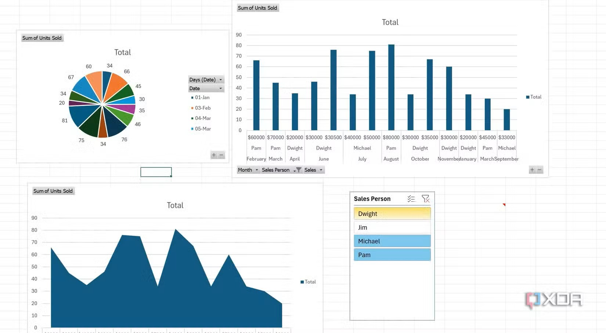
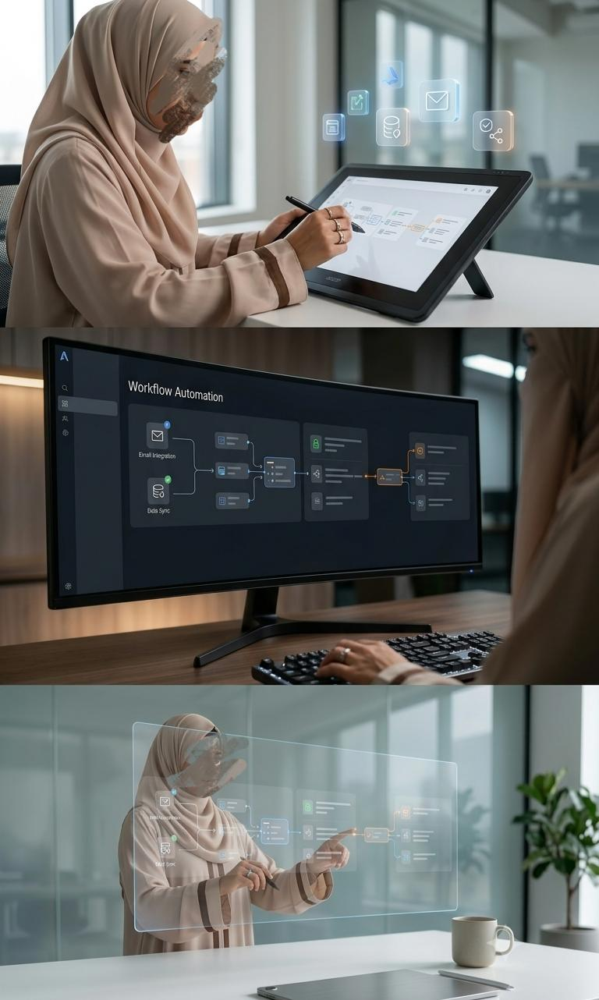

# My-Portfolio
 # Hey, I'm Mubashira Zainab 👋
## — ~ —

  

I bridge the gap between logic and visuals by blending **Graphic Design**, **Data Analytics**, and **AI Automation**. 

I help businesses turn complex datasets into beautiful, interactive stories while building smart AI workflows to eliminate repetitive tasks. 

> ⚡ **What I bring to the table:** Sharp aesthetics, actionable data insights, and automated efficiency all in one place.

---

## 🛠️ My Skills & Tech Stack
* **🎨 Graphic Design:** UI/UX, Data Visualization, Digital Branding (Figma, Adobe CC)
* **📊 Data Analytics:** Python, SQL, Power BI, Tableau, Pandas
* **🤖 AI Automation:** Make.com, Zapier, LLMs, GitHub Actions

---

## 📁 Featured Projects

### 🎨 Project 1: Graphic Design Portfolio
Here is a collection of my visual designs, blending sharp aesthetics with functional UI/UX layouts.

---

### 📊 Project 2: Data Analytics Dashboard
An end-to-end data pipeline that turns raw and complex datasets into beautiful, interactive insights.

---

### 🤖 Project 3: AI Automation Workflow
A smart automation system built to optimize efficiency, connect applications, and eliminate manual work.

---

## Let's Connect!
- **GitHub:** [mubashira-zainab](https://github.com/mubashira-zainab)
- **LinkedIn:** [https://www.linkedin.com/in/mubashira-zainab-a8a4a8354/]
- **Email:**[mubashirazainab2418@gmail.com]
